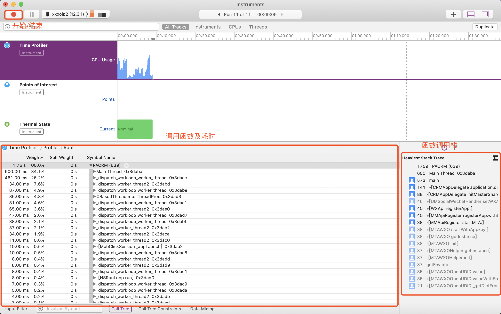
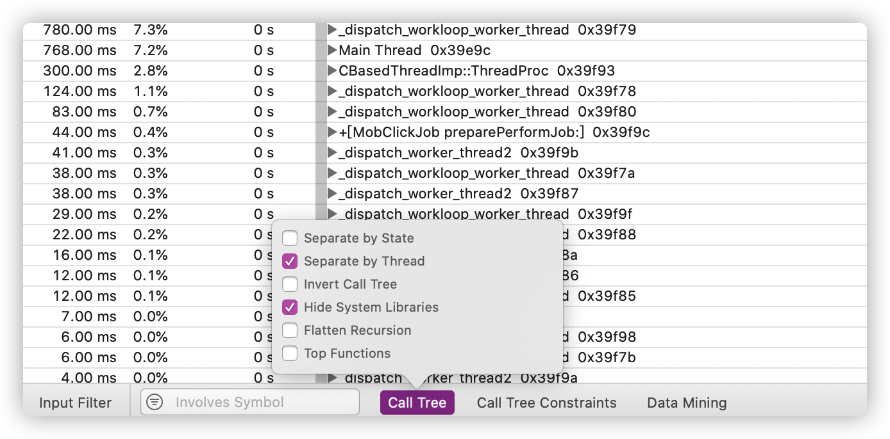
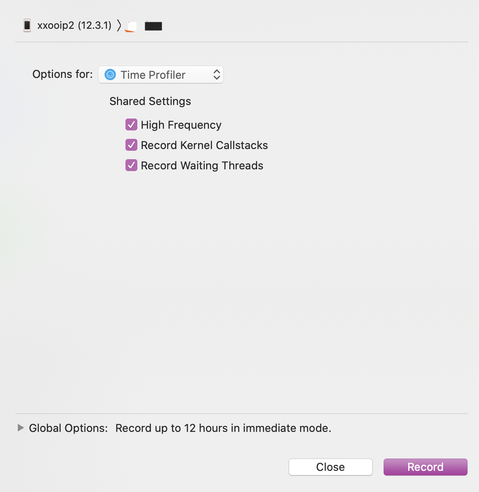
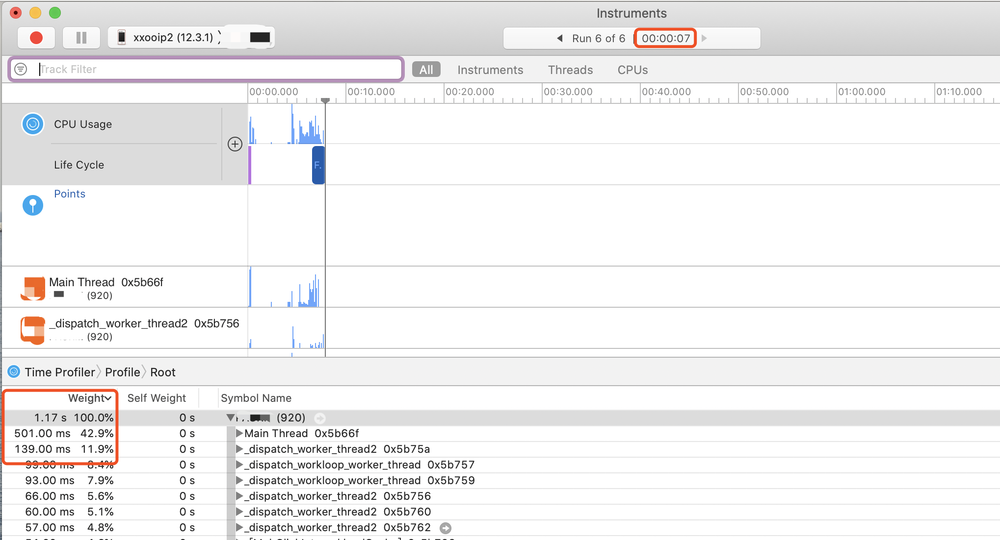
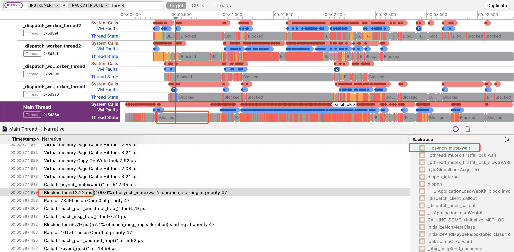
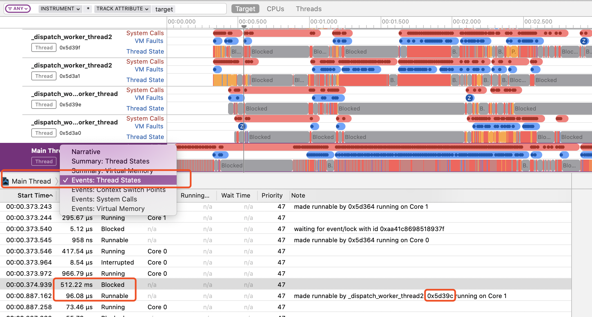
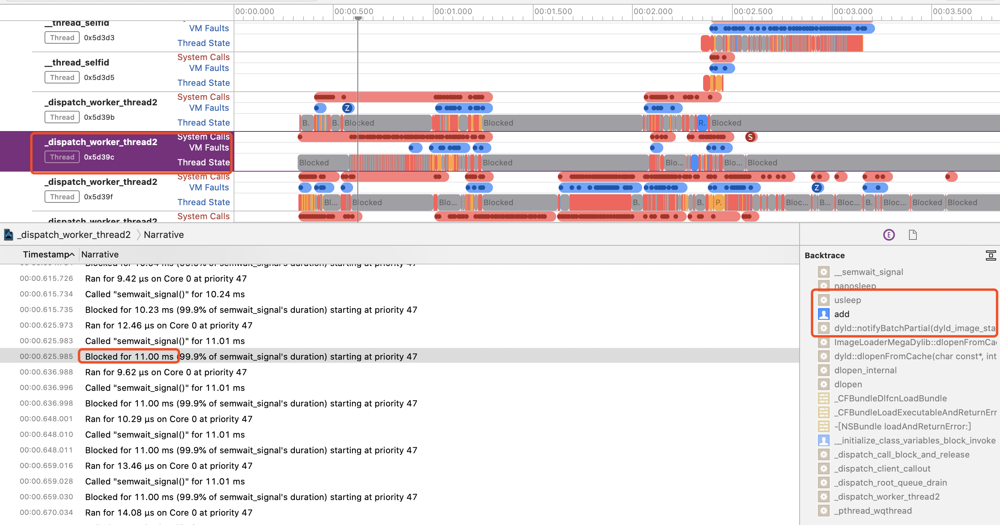

## App启动优化
https://time.geekbang.org/column/article/85331
https://juejin.im/post/5cff0ada6fb9a07edc0b4c3c?utm_source=gold_browser_extension
https://juejin.im/post/5db654fc5188257d606aaf2a?utm_source=gold_browser_extension
https://techblog.toutiao.com/2017/01/17/iosspeed/#more
https://mp.weixin.qq.com/s/jN3jaNrvXczZoYIRCWZs7w

http://yulingtianxia.com/blog/2016/10/30/Optimizing-App-Startup-Time/


##  App的启动耗时

### 介绍

App 的启动时间是体现其性能优劣的一个重要指标，启动时间越快用户的等待时间就越短，提升用户体验感，大厂应用甚至会做到“ 毫秒必究 ”。  

我们将 App 启动方式分为：

| 名称   | 说明                                                         |
| ------ | ------------------------------------------------------------ |
| 冷启动 | App 启动时，应用进程不在系统中（初次打开或程序被杀死），需要系统分配新的进程来启动应用。 |
| 热启动 | App 退回后台后，对应的进程还在系统中，启动则将应用返回前台展示。 |

本篇文章主要针对冷启动方式进行优化分析，介绍常用的检测工具及优化方法。

### 冷启动流程

Apple 官方的[《WWDC Optimizing App Startup Time》](https://developer.apple.com/videos/play/wwdc2016/406) 将 iOS 应用的启动可分为 pre-main 阶段和 main 两个阶段，最佳的启动速度是400ms以内，最慢不得大于20s，否则会被系统进程杀死（最低配置设备）。

为了更好的区分，笔者将整个启动流程分为三个阶段， **App总启动流程 = pre-main + main函数代理（didFinishLaunchingWithOptions）+ 首屏渲染（viewDidAppear）**，后两个阶段都属于 `main函数`  执行阶段。

#### pre-main 执行内容

此时对应的 App 页面是闪屏页的展示。

- 加载可执行文件

  加载 `Mach-O` 格式文件，既 App 中所有类编译后生成的格式为 `.o` 的目标文件集合。

- 加载动态库

  `dyld` 加载 `dylib` 会完成如下步骤：

  1. 分析 App 依赖的所有 dylib。
  2. 找到 dylib 对应的 Mach-O 文件。
  3. 打开、读取这些 Mach-O 文件，并验证其有效性。
  4. 在系统内核中注册代码签名。
  5. 对 dylib 的每一个 segment 调用 mmap()。

  系统依赖的动态库由于被优化过，可以较快的加载完成，而开发者引入的动态库需要耗时较久。

- Rebase和Bind操作

  由于使用了`ASLR` 技术，在 `dylib` 加载过程中，需要计算指针偏移得到正确的资源地址。 `Rebase` 将镜像读入内存，修正镜像内部的指针，消耗 `IO` 性能；`Bind` 查询符号表，进行外部镜像的绑定，需要大量 `CPU` 计算。

- Objc setup

  进行 `Objc` 的初始化，包括注册 `Objc` 类、检测 ` selector` 唯一性、插入分类方法等。

- Initializers

  往应用的堆栈中写入内容，包括执行 `+load` 方法、调用 `C/C++` 中的构造器函数（用 `attribute((constructor))` 修饰的函数）、创建非基本类型的 `C++` 静态全局变量等。

#### main函数代理执行内容

从 `main()` 函数开始执行到 `didFinishLaunchingWithOptions` 方法执行结束的耗时。通常会在这个过程中进行各种工具（监控工具、推送、定位等）初始化、权限申请、判断版本、全局配置等。

#### 首屏渲染执行内容

首屏 `UI` 构建阶段，需要 `CPU` 计算布局并由 `GPU` 完成渲染，如果数据来源于网络，还需进行网络请求。

## 优化方案

### pre-main阶段

#### 检测方法

获得 main() 方法执行前的耗时比较简单，通过 Xcode 自带的测量方法既可以。将 Xcode 中 Product -> Scheme -> Edit scheme -> Run -> Environment Variables 将环境变量 `DYLD_PRINT_STATISTICS` 或 `DYLD_PRINT_STATISTICS_DETAILS`  设为 `1` 即可获得执行每项耗时：

```
// example 
// DYLD_PRINT_STATISTICS
Total pre-main time: 383.50 milliseconds (100.0%)
         dylib loading time: 254.02 milliseconds (66.2%)
        rebase/binding time:  20.88 milliseconds (5.4%)
            ObjC setup time:  29.33 milliseconds (7.6%)
           initializer time:  79.15 milliseconds (20.6%)
           slowest intializers :
             libSystem.B.dylib :   8.06 milliseconds (2.1%)
    libMainThreadChecker.dylib :  22.19 milliseconds (5.7%)
                  AFNetworking :  11.66 milliseconds (3.0%)
                  TestDemo :  38.19 milliseconds (9.9%)

// DYLD_PRINT_STATISTICS_DETAILS
  total time: 614.71 milliseconds (100.0%)
  total images loaded:  401 (380 from dyld shared cache)
  total segments mapped: 77, into 1785 pages with 252 pages pre-fetched
  total images loading time: 337.21 milliseconds (54.8%)
  total load time in ObjC:  12.81 milliseconds (2.0%)
  total debugger pause time: 307.99 milliseconds (50.1%)
  total dtrace DOF registration time:   0.07 milliseconds (0.0%)
  total rebase fixups:  152,438
  total rebase fixups time:   2.23 milliseconds (0.3%)
  total binding fixups: 496,288
  total binding fixups time: 218.03 milliseconds (35.4%)
  total weak binding fixups time:   0.75 milliseconds (0.1%)
  total redo shared cached bindings time: 221.37 milliseconds (36.0%)
  total bindings lazily fixed up: 0 of 0
  total time in initializers and ObjC +load:  43.56 milliseconds (7.0%)
                         libSystem.B.dylib :   3.67 milliseconds (0.5%)
               libBacktraceRecording.dylib :   3.41 milliseconds (0.5%)
                libMainThreadChecker.dylib :  21.19 milliseconds (3.4%)
                              AFNetworking :  10.89 milliseconds (1.7%)
                              TestDemo :   2.37 milliseconds (0.3%)
total symbol trie searches:    1267474
total symbol table binary searches:    0
total images defining weak symbols:  34
total images using weak symbols:  97
```

 ####  优化点

- 合并动态库，并减少使用 `Embedded Framework`，即非系统创建的动态 Framework，如果对包体积要求不严格还可以使用静态库代替。

- 删除无用代码（未使用的静态变量、类和方法等）并抽取重复代码。
- 避免在 `+load` 执行方法，使用 ``+initialize`` 代替。
- 避免使用 `attribute((constructor))`，可将要实现的内容放在初始化方法中配合 `dispatch_once` 使用。
- 减少非基本类型的 C++ 静态全局变量的个数。（因为这类全局变量通常是类或者结构体，如果在构造函数中有繁重的工作，就会拖慢启动速度）

### main函数代理阶段

#### 检测方法

- 手动插入代码计算耗时

  在 `man()` 函数开始执行时就开始时间：

  ```objective-c
  CFAbsoluteTime StartTime;  //  记录全局变量
  int main(int argc, char * argv[]) {
      @autoreleasepool {
          StartTime = CFAbsoluteTimeGetCurrent();
          return UIApplicationMain(argc, argv, nil, NSStringFromClass([AppDelegate class]));
      }
  }
  ```

  再在 `didFinishLaunchingWithOptions` 返回之前获取结束时间，两者的差值即为该阶段的耗时：

  ```objective-c
  extern CFAbsoluteTime startTime; // 申明全局变量
  - (BOOL)application:(UIApplication *)application didFinishLaunchingWithOptions:(NSDictionary *)launchOptions {
    
      //...
      //...
  
        
      double launchTime = (CFAbsoluteTimeGetCurrent() - startTime);
      return YES;
  }
  ```

  通过这种手动埋点的方式也可以对每个函数进行埋点获取耗时，但当函数多时也需要不小的工作量，且后续上线还需要移除代码，不可复用。

- Time Profiler

  `Xcode`自带的工具，原理是定时抓取线程的堆栈信息，通过统计比较时间间隔之间的堆栈状态，计算一段时间内各个方法的近似耗时。精确度取决于设置的定时间隔。    

  通过 Xcode → Open Developer Tool → Instruments → Time Profiler 打开工具，注意，需将工程中 Debug Information Format 的 Debug 值改为 DWARF with dSYM File，否则只能看到一堆线程无法定位到函数。  

  

  通过双击具体函数可以跳转到对应代码处，另外可以将 Call Tree 的 `Seperate by Thread` 和 `Hide System Libraries` 勾选上，方便查看。

  

  正常Time Profiler是每1ms采样一次， **默认只采集所有在运行线程的调用栈**，最后以统计学的方式汇总。所以会无法统计到耗时过短的函数和休眠的线程，比如下图中的5次采样中，method3都没有采样到，所以最后聚合到的栈里就看不到method3。

  

  我们可以将 File -> Recording Options 中的配置调高，即可获取更精确的调用栈。

  

- System Trace

  有时候当主线程被其他线程阻塞时，无法通过 `Time Profiler` 一眼看出，我们还可以使用 `System Trace`，例如我们故意在 `dyld` 链接动态库后的回调里休眠10ms：

  ```objective-c
  static void add(const struct mach_header* header, intptr_t imp) {
      usleep(10000);
  }
  - (BOOL)application:(UIApplication *)application didFinishLaunchingWithOptions:(NSDictionary *)launchOptions
  {
      dispatch_sync(dispatch_get_global_queue(DISPATCH_QUEUE_PRIORITY_DEFAULT, 0), ^{
          _dyld_register_func_for_add_image(add);
      });
    ....
  }
  ```

  

  可以看到整个记录过程耗时7s，但 `Time Profiler` 上只显示了1.17s，且看到启动后有一段时间是空白的。这时通过 `System Trace` 查看各个线程的具体状态。

  

  可以看到主线程有段时间被阻塞住了，存在一个互斥锁，切换到 `Events:Thread State`观察阻塞的下一条指令，发现`0x5d39c` 执行完成释放锁后，主线程才开始执行。

  

  接着我们观察 `0x5d39c` 线程，发现在主线程阻塞的这段时间，该线程执行了多次10ms的 `sleep` 操作，到此就找到了主线程被子线程阻塞导致启动缓慢的原因。

  

  今后，当我们想更清楚的看到各个线程之间的调度就可以使用 `System Trace`，但还是建议优先使用 `Time Profiler`，使用简单易懂，排查问题效率更高。

- App Launch

  Xcode11 之后新出的工具，功能相当于 Time Profiler 和 System Trace 的整合。
  
- Hook  objc_msgSend

  可以对 objc_msgSend 进行 Hook 获取每个函数的具体耗时，优化在启动阶段耗时多的函数或将其置后调用。实现方法可查看笔者之前的文章 [通过objc_msgSend实现iOS方法耗时监控](https://juejin.im/post/5e678c526fb9a07c994bf1d8)。

#### 优化点

- 通过检测工具找到耗时多的函数，拆分其功能，将优先级低的功能延后执行。
- 梳理业务逻辑，把可以延迟执行的逻辑，做延迟执行处理。比如检查新版本、注册推送通知等逻辑。
- 梳理各个二方/三方库，找到可以延迟加载的库，做延迟加载处理，比如放到首页控制器的viewDidAppear方法后。

### 首屏渲染阶段

#### 检测方法

记录首屏 `viewDidLoad` 开始时间和`viewDidAppear` 开始时间，两者的差值即为整个首屏渲染耗时，如果要获得具体每个步骤耗时，则可同main函数代理阶段使用 `Time Profiler` 或 `Hook objc_msgSend`。

#### 优化点

- 使用简单的广告页作为过渡，将首页的计算操作及网络请求放在广告页展示时异步进行。
- 涉及活动需变更页面展示时（例如双十一），提前下发数据缓存。
- 首页控制器用纯代码方式来构建，而不是 `xib/Storyboard`，避免布局转换耗时。
- 避免在主线程进行大量的计算，将与首屏无关的计算内容放在页面展示后进行，缩短 `CPU` 计算时间。
- 避免使用大图片，减少视图数量及层级，减轻 `GPU ` 的负担。
- 做好网络请求接口优化（DNS 策略等），只请求与首屏相关数据。
- 本地缓存首屏数据，待渲染完成后再去请求新数据。

### 全方面方案

启动优化不应该是一次性的，最好的方案也不是在出现才去解决，而应该包括：

- 解决现存的问题
- 后续开发的管控
- 完整的监控体系


## 用到的工具

- Xcode自带工具 Time Profiler 和 System Trace

- Xcode11 之后新增工具 App Launch

- Static Initializer Tracing 

- AppCode 的 Inspect Code 扫描无用代码

- [fui](https://github.com/dblock/fui) 扫描无用的类

- TinyPNG 压缩图片，减少 IO 操作量

- use framework?

  https://mp.weixin.qq.com/s/wTF3JSFH5b2zIUYAbnC-Bw

  

  

  

## 参考资料

- [如何实现 iOS App 的冷启动优化](https://mp.weixin.qq.com/s/CIkpPlTrpMEV9lRTwcABrA)  

- [iOS启动优化](http://lingyuncxb.com/2018/01/30/iOS%E5%90%AF%E5%8A%A8%E4%BC%98%E5%8C%96/)

- [App 启动速度怎么做优化与监控？](https://time.geekbang.org/column/article/85331)

- [如何精确度量 iOS App 的启动时间](https://www.jianshu.com/p/c14987eee107)

- [App Startup Time: Past, Present, and Future](https://developer.apple.com/videos/play/wwdc2017/413/)

- [Instruments Tutorial with Swift: Getting Started](https://www.raywenderlich.com/397-instruments-tutorial-with-swift-getting-started)

- [iOS App冷启动治理：来自美团外卖的实践](https://mp.weixin.qq.com/s/jN3jaNrvXczZoYIRCWZs7w)

- [性能深度分析之System Trace](性能深度分析之System Trace)

- [iOS App 启动性能优化](https://mp.weixin.qq.com/s/Kf3EbDIUuf0aWVT-UCEmbA)

- [马蜂窝 iOS App 启动治理：回归用户体验](https://juejin.im/post/5cd4e784f265da038733bc4b)

  

  


